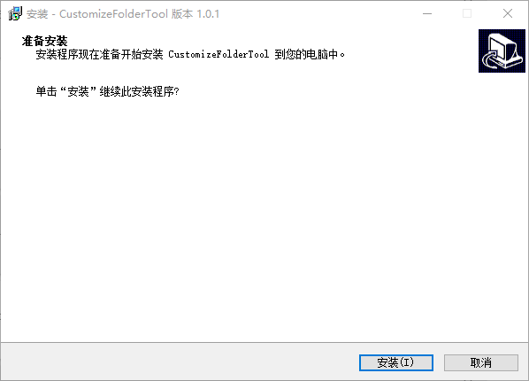

## 介绍
这是一个在Windows下使用的可以自定义文件夹操作的软件

[下载链接](https://github.com/TohckyToki/CustomizeFolderTool/releases/download/v1.0.1/Installer@1.0.1.exe)

主要功能
- 为文件夹添加别名
- 为文件夹更换图标
- 为文件夹添加注释

## 安装流程

双击打开安装程序

点击安装

点击完成，软件就可以安装完毕

## 使用方法

### 添加别名

### 移除别名

### 更换图标

更换图标可能不会实时刷新，需要手动按一下`F5`进行刷新

#### 默认图标

#### 自定义图标

- ico文件

- png文件

### 还原图标

### 添加备注

备注无法及时显示时请手动按下`F5`进行刷新

### 删除备注

备注无法及时清除时请手动按下`F5`进行刷新

## 项目地址

[GitHub仓库](https://github.com/TohckyToki/CustomizeFolderTool)
如果在使用过程中发现问题，请在项目仓库中提交Issue