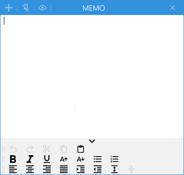

## 介绍
这是一个类似微软提供的便签的软件

[下载链接](https://github.com/TohckyToki/DeltaMemo/releases/tag/1.0.2)

## 写这个程序的目的
我记得以前的时候，微软的便签好像是有一个窗口置顶的功能，但是最近的版本我找不到这个功能了，感觉还是挺遗憾的，毕竟我认为这个功能才是便签软件的精髓。

之前的时候，因为工作比较忙，我用过一段时间的纸质便签，就是那种一小本的彩色纸张，上面有一部分有胶水的那种，随便写点什么，贴在电脑屏幕上，然后完成了之后就把便签撕掉。最方便的地方大概就是一直在屏幕上面，可以随时查看这一点了。

所以为了实现那种感觉，我就决定自己写一个可以置顶的便签软件，随用随开，用完了就撕掉（关闭），什么也不留下来。

由于软件功能并不复杂，写的还是挺顺利的，基本就是写完测试一遍过ヾ(๑╹◡╹)ﾉ"，所以不保证有没有什么隐藏的bug。

## 安装与使用
如果电脑有安装.net 5的执行环境的话下载DeltaMemo-win-x64.zip的包解压执行

如果没有相应的运行环境，就下载DeltaMemoWithRuntime-win-x64.zip这个包解压执行

## 功能简介
其实并没有什么功能，但是为了凑点文章字数，我还是写点吧。。
### 主界面

### 新建窗口

### 窗口置顶

### 从任务栏隐藏

### 其他功能
下面的工具栏里有一些基本的文本操作功能，然后工具栏上方的按钮是可以隐藏和显示工具栏的。另外，工具栏里的栏位是可以拖动位置的。

不过这些设定都只在当前窗口有效，我并没有有实现多窗口状态的共享功能，毕竟这软件初版完成的时候，已经凌晨三点了，一些细枝末节的功能还是等到之后有时间再去添加吧。

## 项目地址

[GitHub仓库](https://github.com/TohckyToki/DeltaMemo)
如果在使用过程中发现问题，请在项目仓库中提交Issue